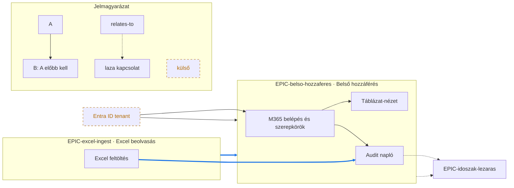

# Worked example: backlog `## Dependency Edges` → Mermaid dependency graph

One end-to-end render showing the non-obvious moves: reading only the `## Dependency Edges` blocks (never the `## Risks and Dependencies` prose), **deduping an inverse pair** (`blocks` on one card + `depends-on` on the other → one edge), drawing epics as `subgraph`s with their stories inside, highlighting the **cross-epic** edge, and drawing an `external:` dependency as a dashed leaf blocker.

## Input — the `## Dependency Edges` blocks (pipeline-only, on each card)

`EPIC-belso-hozzaferes.md`:

```markdown
## Dependency Edges
- depends-on: `EPIC-excel-ingest`
- relates-to: `EPIC-idoszak-lezaras`
- external: Entra ID tenant
```

`STORY-belso-hozzaferes-m365-szerepkorok.md` (the foundation story):

```markdown
## Dependency Edges
- blocks: `STORY-belso-hozzaferes-tablazat-nezet`
- blocks: `STORY-belso-hozzaferes-audit-naplo`
- external: Entra ID tenant
```

`STORY-belso-hozzaferes-tablazat-nezet.md`:

```markdown
## Dependency Edges
- depends-on: `STORY-belso-hozzaferes-m365-szerepkorok`
```

`STORY-belso-hozzaferes-audit-naplo.md`:

```markdown
## Dependency Edges
- depends-on: `STORY-belso-hozzaferes-m365-szerepkorok`
- depends-on: `STORY-excel-ingest-excel-feltoltes`
- relates-to: `EPIC-idoszak-lezaras`
```

The `m365-szerepkorok` card says it `blocks` `tablazat-nezet`, and `tablazat-nezet` says it `depends-on` `m365-szerepkorok` — the **same edge** stated from both ends. It is drawn **once** (`m365 → tablazat`), not twice.

## Output — `openspec/backlog/DEPENDENCY_GRAPH.md`

````markdown
# Backlog függőségi gráf

Származtatott nézet a story-k és epicek `## Dependency Edges` blokkjaiból. Ne szerkeszd kézzel — javíts a kártyán, majd generáld újra. A nyíl végrehajtási sorrendet jelöl: **blokkoló → blokkolt** ("előbb kell").



## Notes
- Körfüggőség: nincs (a `blocks`/`depends-on` élek DAG-ot alkotnak).
- Lógó cél: nincs kihagyva — minden trace-ID megvan a backlogban.
- Összecsukott epic: nincs (egyik subgraph sem lépte túl a ~15 node-os határt).
- Külső csomópont: `Entra ID tenant` (nincs Jira-linkje).
````

## Why these moves

- **Only the edge block is read** — the `## Risks and Dependencies` prose on these cards may say more, but the graph keys off `## Dependency Edges` alone, so the picture is deterministic.
- **Inverse pair → one edge** — `m365 blocks tablazat` and `tablazat depends-on m365` collapse to the single `S_m365 --> S_tabla`. The graph never double-draws an edge stated from both ends.
- **Epics are subgraphs, cross-epic edges are highlighted** — `EPIC-excel-ingest` blocking `EPIC-belso-hozzaferes` is the graph's most load-bearing fact (a whole epic waits on another), so it gets the thick blue `==>` / `linkStyle`; the story-level cross-epic edge (`S_ingest --> S_audit`) is highlighted the same way — the rule is *every* cross-epic edge, not just epic-to-epic. Intra-epic edges stay thin.
- **Direction is blocker → blocked, always** — `EXT_entra --> S_m365` reads "Entra ID must exist before the M365 story", the same rule as every other arrow. The legend states it once.
- **External is a dashed leaf** — `Entra ID tenant` has no trace ID, so it can never be a Jira link (`pte-openspec-jira-sync` skips it); here it is a dashed blocker node, keeping the picture complete without pretending it is backlog work. One node per distinct label: both the epic and the `m365` story declared it, so the single node blocks both (`EXT_entra --> S_m365`, `EXT_entra --> EPIC_belso`).
- **`## Notes` carries the anomalies** — cycles, skipped dangling targets, and collapsed epics are named there, so a clean graph and a graph-hiding-a-problem never look alike.
